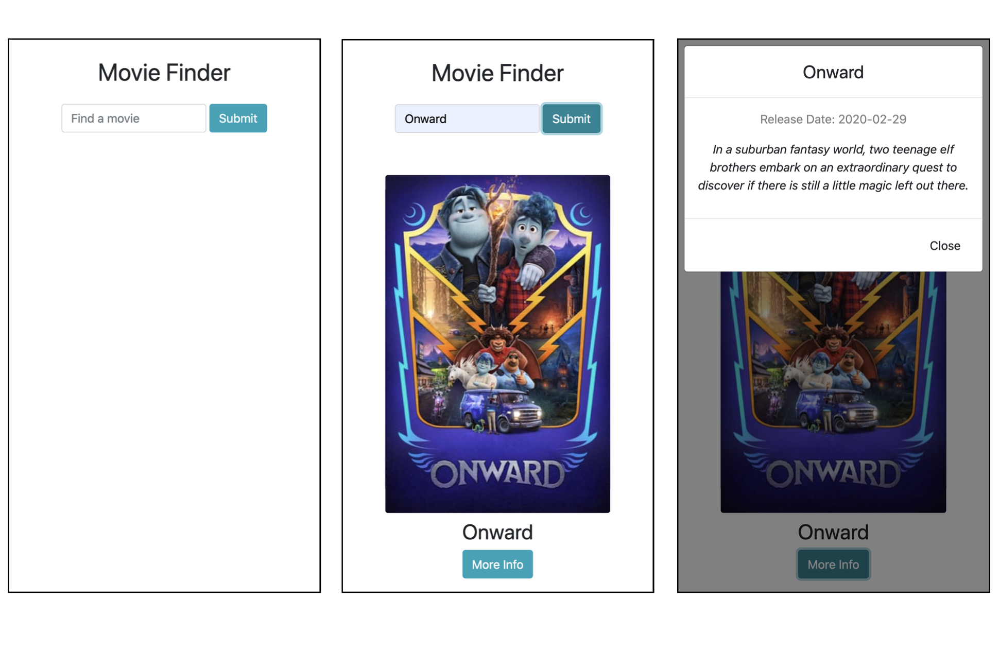

## Movie Finder

A simple UI for searching themoviedb.org's API.
Started from https://github.com/lewagon/webpack-boilerplate
All project source code is contained in the ./src/ directory

User Experience

- User can search for a movie
- User can select a movie from a list of options that match user's search
- User can select a movie from the list to see more details about the movie

